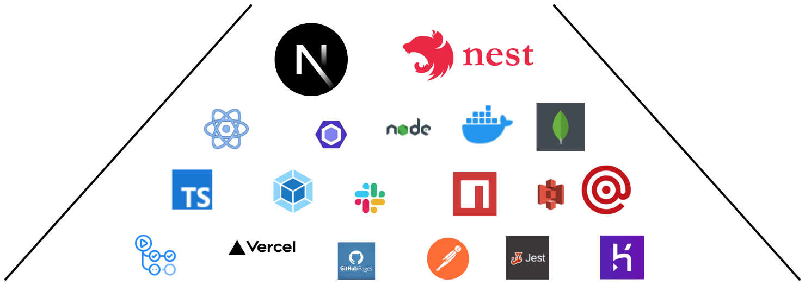

<h1 align="center">
    
</h1>

<h2 style="display:flex;align-items:center;gap:1rem">
    Welcome to NinjaCo
    
</h2>

A company that strives to provide the best educational experience for students that are interested in learning about and developing their skills in the field of software engineering.

### Table of Contents

- [NinjaCo Nextjs](https://github.com/NinnjaCo/ninjaco-nextjs)
- [NinjaCo Nestjs](https://github.com/NinnjaCo/ninjaco-nestjs)

Checkout each repository for more information.

<h2 style="display:flex;align-items:center;gap:1rem">
    Tech Stack
    
</h2>

 
 
 
 

<h2 style="display:flex;align-items:center;gap:1rem">
    Contributors
    
</h2>

- Ahmad Issa
- Charbel Fayad
- Raghid El Khoury
- Tony Abou Sleiman
